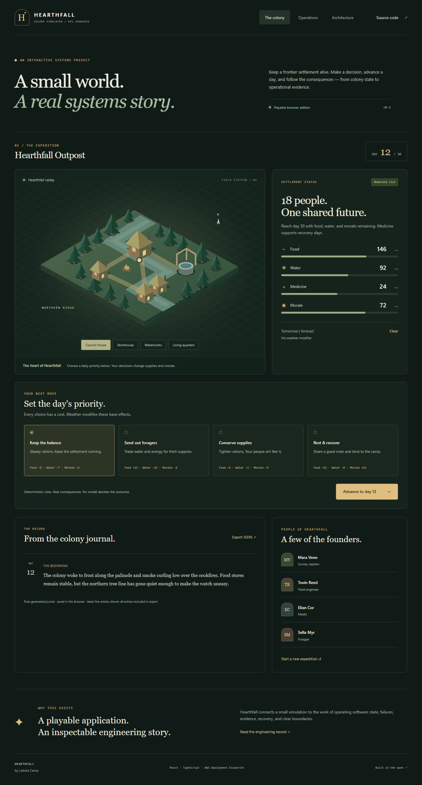
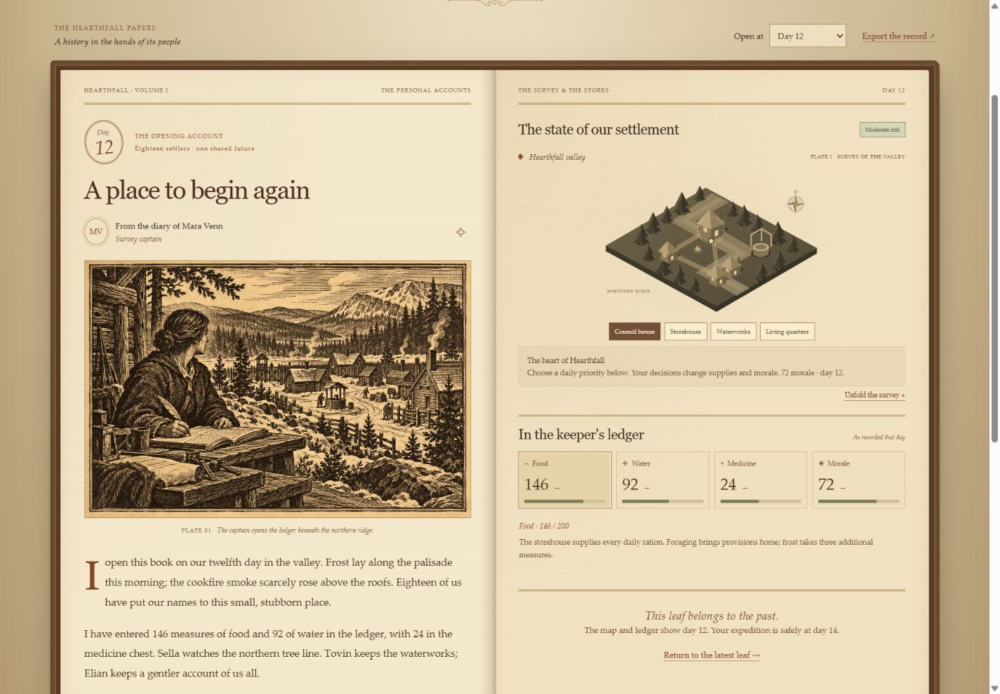
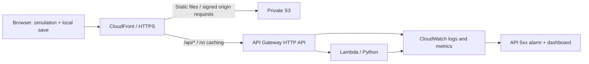

# Hearthfall

### A small world. A real systems story.

**Colony Simulator Ops Showcase** by Lakota Camp. A playable frontier settlement paired with an inspectable AWS operations environment.

**[Play Hearthfall on AWS](https://d1ka8cpbx2rxkb.cloudfront.net/)** · [Deployment evidence](docs/operations/aws-verification.md) · [Architecture](docs/architecture/hearthfall.md) · [Incident runbook](docs/operations/runbooks/diagnostic-failure.md)

Keep 18 settlers alive until day 30. Choose a priority, advance a day, and see deterministic resource changes and a readable journal. Open Operations to probe a service, introduce a request-scoped failure, and verify recovery.



[Mobile view](docs/screenshots/hearthfall-mobile.jpg). These overview screenshots show the browser edition. [Live AWS request evidence](docs/screenshots/hearthfall-aws-requests.jpg) records the deployed API exercise.

The colony uses an antique chronicle theme: parchment, sepia typography, ornamental borders, a compass rose, and journal drop caps. Operations and Architecture retain their original dark green palette. The theme uses local fonts, CSS, and SVG without external image or font requests.

## What is implemented

### Illustrated book edition (v0.3 preparation)

The colony now has facing book pages, animated leaf turns, first-person character diaries, browsable historical maps and ledgers, and interactive supply decisions. An original generated woodcut opens the book. Fresh per-turn AI illustration jobs are implemented with idempotency and atomic public-site allowances, but **AWS model activation and live image verification are pending**. See the [concrete deployment review](docs/deployment/book-release-review.md) and [art direction and prompt record](docs/design/book-art-direction.md). The currently verified AWS service below remains the v0.2 deployment until that review is executed.



### Core application and verified AWS deployment

- **Playable simulation:** four priorities, predictable weather, bounded resources, recoverable risk, and a defined win/loss condition.
- **Browser persistence:** a versioned, validated local save and JSON journal export. Colony data stays in the visitor's browser.
- **Operations console:** actual current-session probe results, request IDs, client-observed latency, and a controlled failure/recovery flow. Browser-only responses are explicitly labeled.
- **Python API:** stateless health and diagnostic endpoints, structured logs, request validation, and diagnostics disabled by default.
- **AWS infrastructure as code:** private S3, CloudFront origin access control, API Gateway HTTP API, Lambda, CloudWatch logs, a dashboard, and a 5xx alarm.
- **Validation:** simulation and persistence tests, backend tests, lint/build checks, and CloudFormation schema validation in GitHub Actions.

**Deployment status:** live on AWS in `us-east-1`. Release v0.2.1 reached CloudFormation `CREATE_COMPLETE`; the deployed app passed a real 200 → 503 → 200 request exercise with correlated Lambda and API logs and a verified CloudWatch **OK → ALARM → OK** transition. See the [dated verification record](docs/operations/aws-verification.md) for observations and limits. The [GitHub Pages browser edition](https://lakotacamp.github.io/aws-cloudops-security-lab/) remains available with explicitly simulated probes.

## Try it locally

Use Node.js 24 and Python 3.13 (backend tests also run on 3.12).

```sh
cd app/frontend
npm ci
npm run dev
```

Open the address printed by Vite. No AWS account or credentials are needed for browser mode. Select **Operations → Check service → Trigger diagnostic failure → Verify recovery** to explore the demonstration.

## Architecture



The API demonstrates an operational request path; it does **not** execute turns or store colony saves. This boundary keeps the application useful when the diagnostic service is unavailable and avoids account management or a database for this scope.

### Decisions worth inspecting

| Decision | Reason and tradeoff |
| --- | --- |
| Deterministic TypeScript simulation | Reproducible turns; no model-generated state or runtime AI dependency. |
| Browser-local persistence | No account or server-side personal data; saves do not follow visitors between devices. |
| Private S3 + CloudFront OAC | Public HTTPS delivery without a public bucket; distribution-scoped origin permission. |
| Narrow public, stateless API | No secrets or colony data exposed; anonymous traffic can still incur charges. |
| Intentional HTTP 503 | Produces a real request failure without affecting other requests; alarm on API 5xx, because Lambda can return 503 successfully. |
| Native metrics and seven-day logs | Enough evidence for a small incident exercise; no private telemetry published to visitors. |

See the [current architecture and security boundaries](docs/architecture/hearthfall.md), [deployment/cost/cleanup guide](docs/deployment/aws-deployment.md), [diagnostic incident runbook](docs/operations/runbooks/diagnostic-failure.md), and [deployment failure and dependency fix](docs/operations/deployment-incident.md).

## Validation

```sh
cd app/frontend
npm test
npm run lint
npm run build
cd ../..
python -m unittest discover -s app/backend -p 'test_*.py' -v
node infrastructure/build-template.mjs --check
node --test infrastructure/template.test.mjs
pip install -r infrastructure/requirements-validation.txt
cfn-lint infrastructure/template.json
```

Tests cover state immutability, resource boundaries and actual deltas, weather, risk recovery, a complete expedition, save validation, and API healthy → diagnostic 503 → healthy behavior. They do not prove deployed IAM permissions, edge routing, metrics delivery, or alarm transitions; verify those with the deployment checklist.

Release v0.2.1 (`3afc542`): [16 tests, lint, production build, and infrastructure verification passed](https://github.com/lakotacamp/aws-cloudops-security-lab/actions/runs/37410420538), and [Pages publication succeeded](https://github.com/lakotacamp/aws-cloudops-security-lab/actions/runs/37410420572). Browser checks covered desktop/mobile layout, a resource-changing turn, persistence after refresh, restart, and exported JSON. The AWS site was opened and tested after deployment, including actual failure/recovery and security-header checks.

## Repository map

- `app/frontend/src/simulation` — authoritative turn rules.
- `app/frontend/src/lib` — validated browser persistence and probe client.
- `app/frontend/src/components` — settlement map, operations console, architecture explorer.
- `app/backend` — Lambda handler and unit tests; standard library only.
- `infrastructure` — template generator, generated CloudFormation, release helpers.
- `docs` — architecture decisions, deployment guide, and runbooks.

Older VPC/EC2 diagrams, the original roadmap, and the previous static deployment plan are historical planning artifacts. They are **not** the deployed or current application architecture. The verified v0.2 deployment does not use DynamoDB or Bedrock; the prepared book edition adds those for illustration jobs. EC2, VPC, CloudTrail trails, SNS, WAF, and user authentication remain outside scope.

## Scope and contribution

This is an AI-assisted portfolio project. Product requirements and direction came from Lakota Camp; Codex assisted with implementation, tests, and documentation. This repository records the implementation and its verification without claiming unaided authorship or unverified production operation.

Known limits: no cloud save or multiplayer; browser storage is editable by its owner; no uptime SLO; no automatic remediation or notifications; rate limits are best effort rather than a billing cap. Medicine is tracked as a consumable but does not independently end an expedition.
