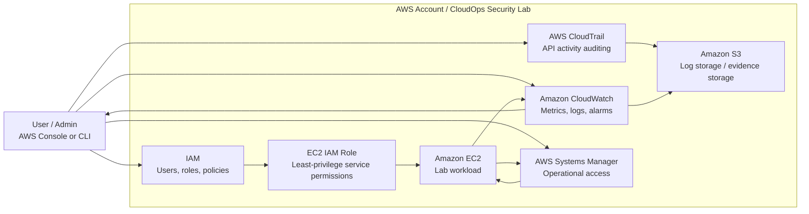

# AWS CloudOps Security Lab — Architecture Diagram v1

## Purpose

This first-version architecture diagram shows the planned monitoring, logging, access, and operational-management components for the AWS CloudOps Security Lab.

This diagram is intentionally simple. It is a starting point for the portfolio project and will be expanded as hands-on labs are added.

## Diagram

## Component Summary

| Component | Purpose |
|---|---|
| User / Admin | Operates the lab through the AWS Console or CLI. |
| IAM | Controls access using users, roles, policies, and least privilege. |
| EC2 | Represents the monitored lab workload. |
| EC2 IAM Role | Allows the EC2 instance to interact with approved AWS services without storing long-term credentials on the instance. |
| CloudWatch | Collects metrics and logs, supports alarms, and provides monitoring visibility. |
| CloudTrail | Records AWS API activity for audit and investigation. |
| S3 | Stores logs, exported evidence, and future lab artifacts. |
| Systems Manager | Provides operational management access, such as Session Manager, where applicable. |

## Notes

- This is a v1 architecture diagram, not the final production design.
- Future versions may add VPC boundaries, public/private subnets, security groups, SNS notifications, CloudWatch Agent details, AWS Config, EventBridge, and Lambda remediation workflows.
- Raw study notes and private mistake logs are intentionally excluded from this public-facing diagram.