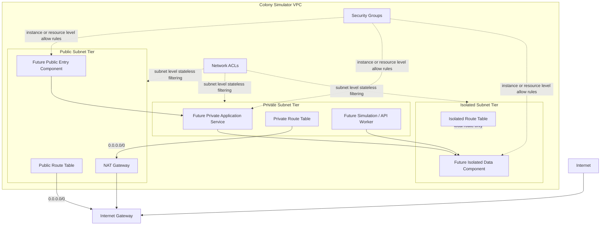

# Colony Simulator Ops Showcase — VPC Architecture Outline

## Purpose

This document outlines a public-safe VPC networking design for the Colony Simulator Ops Showcase.

The goal is to show how the project can separate public-facing entry points, private application workloads, and isolated data or administrative components using standard AWS networking patterns.

This is an architecture outline, not a raw lab record. It does not include account-specific resource IDs, temporary lab values, private notes, or study-process details.

---

## High-Level Networking Goal

The Colony Simulator Ops Showcase should eventually support:

* A public-facing web experience
* Private backend application services
* Isolated data resources where possible
* Clear routing boundaries
* Layered network controls
* Auditable infrastructure changes
* Future integration with the Ops Dashboard

The VPC design should make it easy to explain which resources can reach the internet, which resources can only make outbound requests, and which resources should remain isolated from direct internet access.

---

## Proposed Subnet Tiers

### Public Subnet Tier

Purpose:

Host public entry resources or internet-facing network components.

Example future resources:

* Public load balancer, if needed
* NAT Gateway
* Bastion host only if a future design explicitly requires one
* Public-facing edge/network resources

Routing pattern:

* Local VPC route for internal traffic
* `0.0.0.0/0` route to an Internet Gateway

Public subnet rule:

A subnet is public when its route table sends internet-bound IPv4 traffic to an Internet Gateway.

---

### Private Subnet Tier

Purpose:

Host application resources that need outbound internet access but should not be directly reachable from the public internet.

Example future resources:

* Backend application services
* Private Lambda networking, if the backend later needs VPC access
* Internal APIs
* Workers or application processing components

Routing pattern:

* Local VPC route for internal traffic
* `0.0.0.0/0` route to a NAT Gateway in a public subnet

Private subnet rule:

A subnet is private when it does not route directly to an Internet Gateway but can make outbound internet requests through a NAT Gateway.

This allows private resources to retrieve updates, call external services, or reach AWS public endpoints when needed, without accepting direct inbound internet traffic.

---

### Isolated Subnet Tier

Purpose:

Host resources that should not have direct internet access.

Example future resources:

* Database resources
* Internal-only state storage components
* Sensitive administrative or data-processing components
* Resources that should communicate only inside the VPC or through controlled private paths

Routing pattern:

* Local VPC route only
* No `0.0.0.0/0` route to an Internet Gateway
* No `0.0.0.0/0` route to a NAT Gateway

Isolated subnet rule:

A subnet is isolated when it has no internet route. It can communicate locally within the VPC, but it does not have a direct default route to the public internet.

---

## Diagram Outline

---

## Route Table Summary

| Subnet Tier     | Default Route | Target           | Internet Reachability                                                     |
| --------------- | ------------- | ---------------- | ------------------------------------------------------------------------- |
| Public subnet   | `0.0.0.0/0`   | Internet Gateway | Direct inbound and outbound possible, depending on resource configuration |
| Private subnet  | `0.0.0.0/0`   | NAT Gateway      | Outbound internet access only; no direct inbound internet route           |
| Isolated subnet | None          | Local route only | No direct internet route                                                  |

---

## Security Groups vs Network ACLs

### Security Groups

Security groups operate at the resource level.

Use security groups to define which traffic is allowed to reach a specific resource, such as an application service or database.

Key characteristics:

* Stateful
* Allow rules only
* Attached to resources
* Best used for workload-specific access control

Example project use:

* Allow the application service to receive traffic only from the public entry component or API layer.
* Allow the data component to receive traffic only from the backend application layer.
* Avoid broad inbound access from the internet.

---

### Network ACLs

Network ACLs operate at the subnet level.

Use NACLs as an additional subnet boundary control when subnet-wide filtering is required.

Key characteristics:

* Stateless
* Supports allow and deny rules
* Evaluated by rule number
* Applies to all resources in the subnet

Example project use:

* Keep default NACL behavior simple during MVP.
* Add subnet-level controls later only when there is a clear operational or security reason.
* Document any NACL changes carefully because stateless rule behavior can create confusing reachability issues.

---

## CloudTrail Audit Relevance

Networking changes should be auditable.

CloudTrail can help answer questions such as:

* Who changed a route table?
* Who associated a subnet with a route table?
* Who created or deleted an Internet Gateway?
* Who created or deleted a NAT Gateway?
* Who modified a security group?
* When did the networking change happen?
* From what source did the API call originate?

For the Colony Simulator Ops Showcase, CloudTrail evidence can support public-safe incident and audit stories, such as:

* Investigating an unexpected route table change
* Reviewing a security group modification
* Confirming when public access was added or removed
* Supporting a future “network change review” panel in the Ops Dashboard

CloudTrail is for AWS API activity and audit evidence. CloudWatch is for operational metrics, logs, alarms, and dashboards.

---

## Future Ops Dashboard Connection

The Ops Dashboard can eventually include a networking/security section that summarizes:

* Current subnet tier model
* Public, private, and isolated route expectations
* Recent CloudTrail networking change events
* Security group change history
* NACL change history, if used
* VPC Flow Logs summary, if enabled later
* Reachability or connectivity check results
* Links to relevant runbooks and decision records

The goal is not to expose sensitive infrastructure details publicly. The goal is to show that the project is designed with clear network boundaries and auditable operational controls.

---

## MVP Notes

This VPC architecture may not be required for the first frontend-only MVP.

The first project deployment can begin with static frontend hosting. VPC-backed components should be added only when the backend architecture requires them.

This keeps the project aligned with the build principle:

1. Build a narrow deployed product first.
2. Add AWS infrastructure intentionally.
3. Attach CloudOps and security evidence as the system grows.
4. Keep public documentation polished and employer-facing.
