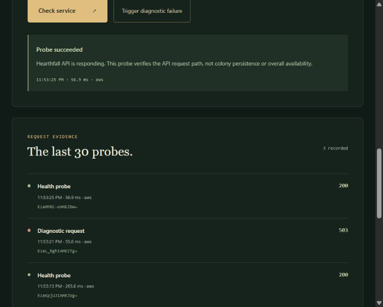

# AWS deployment and diagnostic evidence

**Live application:** [Hearthfall on AWS](https://d1ka8cpbx2rxkb.cloudfront.net/)

Verified on October 5, 2026 in America/New_York (October 6 UTC). This is a dated deployment exercise, not an uptime or production-readiness claim. The frontend's Operations view shows each visitor's own requests; account-wide CloudWatch data remains private.

## Release and deployment

- Release: [v0.2.1](https://github.com/lakotacamp/aws-cloudops-security-lab/releases/tag/v0.2.1), commit `3afc542793200f7b11479365244bdd14e889397f`.
- Archive SHA-256: `094422a675207e62a5fa18e7c9d200bbc9cb172272eb11e80e863798ff2300f9`; checked inside CloudShell before extraction.
- Dedicated stack: `hearthfall-live`, region `us-east-1`, 19 resources.
- CloudFormation reached `CREATE_COMPLETE` at **2026-10-06 03:52:21 UTC**. The frontend upload followed completion.
- The first attempt rolled back; its [cause and dependency fix](deployment-incident.md) are documented separately. Its retained S3 bucket was inspected, found empty (`KeyCount: 0`, not truncated), and removed without deleting any objects. The failed stack's event record remains available for investigation.

## Browser behavior

The AWS URL served the application over HTTPS with runtime configuration `{"apiBaseUrl":"/api"}`. A balanced turn advanced day 12 to 13: food 146 → 137, water 92 → 85, medicine 24 → 23, morale 72 → 70. These values survived a refresh and remained unchanged after the diagnostic exercise. No unexpected browser warnings or errors were captured during the check.

## Controlled request sequence

Times below come from the Lambda log timestamps in UTC. The browser's local timestamp and measured round-trip duration are separate observations and may differ from the service clock.

| Step | UTC time | Route | HTTP | Request ID | Browser duration |
| --- | --- | --- | --- | --- | --- |
| Baseline | 03:53:14.259914 | GET `/api/status` | 200 | `EzaKpjUJIAMEZVg=` | 265.6 ms |
| Diagnostic | 03:53:22.675670 | POST `/api/diagnostic` | 503 | `EzaL_hghIAMEZTg=` | 55.6 ms |
| Follow-up | 03:53:26.126021 | GET `/api/status` | 200 | `EzaMhhC-oAMEZbw=` | 56.9 ms |

All three browser responses identified their source as `aws`. Structured Lambda logs contained the same IDs, routes, and status codes. The diagnostic log recorded `diagnostic: true`; the surrounding health requests recorded `false`. Handler-work durations were 0.035, 0.034, and 0.030 ms respectively; these exclude the network and Lambda platform overhead.

API access logs independently recorded the same three IDs and statuses. Their `responseLatency` values were 226, 22, and 35 ms respectively. API access-log delivery lagged behind Lambda log delivery during the first read.

[Current-session probe metrics](../screenshots/hearthfall-aws-operations.jpg).

The diagnostic affects only its own request. The successful follow-up establishes that the next request worked; it does not establish an account-wide recovery or immediately reset an aggregated alarm.

## Native metric and alarm evidence

CloudWatch returned API Gateway `5xx` Sum **1** for the 60-second period beginning **03:53:00 UTC**. Alarm history recorded **OK → ALARM at 03:54:43.609 UTC**, citing that datapoint against the threshold of 1. This is an observed CloudWatch transition, not a value inferred from the browser's HTTP status.

Lambda `Errors` Sum was **0** for the same minute. The function completed normally and deliberately returned an HTTP 503, demonstrating why an API error alarm is needed in addition to function-error monitoring. Another health request succeeded at **03:55:53.563473 UTC** with `diagnostic: false`.

Alarm history subsequently recorded **ALARM → OK at 03:57:43.611 UTC**, citing the **0** 5xx datapoint for **03:55:00 UTC**. No alarm state was manually forced. The complete observed sequence was **OK → ALARM → OK**. Detection took approximately 81 seconds after the diagnostic response; the later transition illustrates metric publication and evaluation delay rather than a three-minute application outage.

The native CloudWatch dashboard loaded its API Count/5xx/4xx graph, Lambda Duration graph, and alarm widget. The account console and its identifiers remain private; the public evidence includes only the relevant observations and application screenshots.

## Security and delivery checks

- Public CloudFront page: HTTP 200; direct anonymous S3 `index.html` request: HTTP 403.
- All four S3 Block Public Access settings are `true`.
- The deployed bucket policy allows `s3:GetObject` to the CloudFront service only when `AWS:SourceArn` matches this distribution, and denies non-TLS S3 access.
- The deployed `WriteOwnLogs` runtime policy grants only `logs:CreateLogStream` and `logs:PutLogEvents` against the function's own log group. The role had no attached managed policies.
- Delivered security headers: CSP restricted to same-origin scripts/styles/connections, `object-src 'none'`, `frame-ancestors 'none'`, HSTS for one year, `X-Frame-Options: DENY`, `X-Content-Type-Options: nosniff`, and `Referrer-Policy: strict-origin-when-cross-origin`.
- S3 response reported server-side encryption `AES256`.
- Entry page/config: `Cache-Control: no-cache`. Hashed JavaScript: `public, max-age=31536000, immutable`. API health: `no-store`.

## What this proves and what remains limited

This exercise checks the deployed edge/origin/API request path, browser persistence, a request-scoped failure, logging, and selected access controls. It is not a load test, penetration test, availability SLO, billing cap, or general proof of least privilege. Diagnostics remain enabled for portfolio demonstration and can be disabled through the stack parameter. No SNS notification or automatic remediation is configured.

See the [repeatable runbook](runbooks/diagnostic-failure.md) and [cost and cleanup guide](../deployment/aws-deployment.md). Account IDs, private console URLs, full log streams, and unrelated resources are deliberately omitted.
